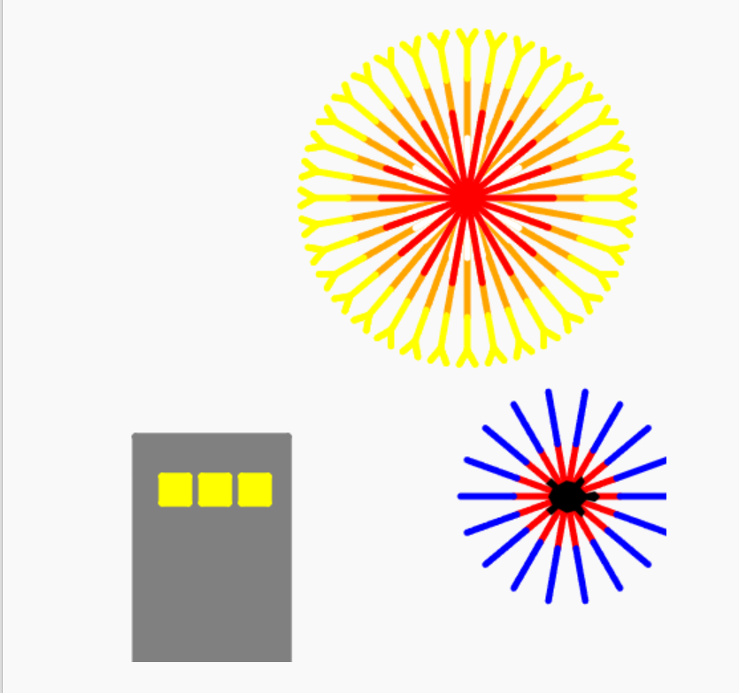

# INNOVATOR Month3 Week2

## for文で夜のまちと花火を作ろう

# 目的
pythonのfor文を使って、夜のまちと花火の絵を作ろう<br>

# 内容目標
for文の使い方をマスターする

# 目次
<details><summary> 導入 </summary>

- [今日作るもの](#今日作るもの)
- [プログラム全体図](#プログラム全体図)

</details>

<details><summary> python リファレンス </summary>

<details><summary> turtleの基本 </summary>

- [turtleの基本](#turtleの基本)
  - [前に進む](#前に進む)
  - [向きを変える](#向きを変える)
  - [線を引かずに移動する](#線を引かずに移動する)
  - [色を変える](#色を変える)
  - [塗りつぶす](#塗りつぶす)

</details>

<details><summary> for文の復習 </summary>

- [for文の復習](#for文の復習)
  - [同じ命令をくり返す](#同じ命令をくり返す)
  - [四角形を描く](#四角形を描く)
  - [Work1 四角形の大きさを変えてみよう](#Work1-四角形の大きさを変えてみよう)

</details>

</details>

<details><summary> ミッション </summary>

<details><summary> STEP1 ビルを作ろう </summary>

- [STEP1 ビルを作ろう](#STEP1-ビルを作ろう)
  - [①四角形を描く](#①四角形を描く)
  - [②色を付けて塗りつぶす](#②色を付けて塗りつぶす)
  - [Work2 ビルの高さを変えてみよう](#Work2-ビルの高さを変えてみよう)

</details>

<details><summary> STEP2 窓を並べよう </summary>

- [STEP2 窓を並べよう](#STEP2-窓を並べよう)
  - [①線を引かずに移動する](#①線を引かずに移動する)
  - [②for文で窓を横に並べる](#②for文で窓を横に並べる)
  - [Work3 窓の数を変えてみよう](#Work3-窓の数を変えてみよう)

</details>

<details><summary> STEP3 花火を作ろう </summary>

- [STEP3 花火を作ろう](#STEP3-花火を作ろう)
  - [①中心から線を伸ばす](#①中心から線を伸ばす)
  - [②for文で花火にする](#②for文で花火にする)
  - [Work4 花火の色と大きさを変えてみよう](#Work4-花火の色と大きさを変えてみよう)

</details>

<details><summary> STEP4 夜のまちを完成させよう </summary>

- [STEP4 夜のまちを完成させよう](#STEP4-夜のまちを完成させよう)
  - [完成条件](#完成条件)
  - [完成例の枠組み](#完成例の枠組み)

</details>

<details><summary> Ex </summary>

- [Ex1 窓を2段にしてみよう](#Ex1-窓を2段にしてみよう)
- [Ex2 ビルを増やしてみよう](#Ex2-ビルを増やしてみよう)
- [Ex3 花火を増やしてみよう](#Ex3-花火を増やしてみよう)
- [Ex4 プログラムを見やすくしよう](#Ex4-プログラムを見やすくしよう)

</details>

</details>

<details><summary> まとめ </summary>

- [まとめ](#まとめ)
- [補足](#補足)
- [参考文献](#参考文献)

</details>

# 今日作るもの
今日作る作品は、**夜のまちと花火**です。<br>




完成作品には、以下の部品を入れます。
- ビル
- 窓
- 花火

自由に何でも作るのではなく、今日は「夜のまちと花火」というテーマに沿って作ります。<br>
ただし、色・大きさ・数・場所は自分で変えて ok です。<br>

# プログラム全体図
①for文でビルの形を作る<br>


②begin_fill / end_fill を使ってビルを塗りつぶす<br>


③penup / pendown を使って、窓の場所まで移動する<br>


④for文で窓を横に並べる<br>


⑤for文で花火を作る<br>


⑥色や数を変えて、自分の作品にする<br>


★★一旦完成★★

Ex. 窓を2段にする<br>
Ex. ビルを増やす<br>
Ex. 花火を増やす<br>
Ex. 関数を使ってプログラムを見やすくする<br>

Exは順不同。<br>

# プログラム

プログラムは以下から書いてください

<a href="https://trinket.io/python/80fea69346" target="_blank" rel="noopener noreferrer">https://trinket.io/python/80fea69346</a>

# turtleの基本


## 前に進む<br>
```python:python
forward(100)
```

`forward(100)`は、今向いている方向に100進む命令です。<br>

## 向きを変える<br>
```python:python
right(90)
left(90)
```

`right(90)`は右に90度曲がる命令です。<br>
`left(90)`は左に90度曲がる命令です。<br>

## 線を引かずに移動する<br>
```python:python
penup()
forward(100)
pendown()
```

`penup()`を使うと、線を引かずに移動できます。<br>
`pendown()`を使うと、もう一度線を引けるようになります。<br>

## 色を変える<br>
```python:python
pencolor("red")
color("yellow")
```

`pencolor`は、線の色を変えます。<br>
`color`は、線と塗りつぶしの色をまとめて変えるときに使います。<br>

## 塗りつぶす<br>
```python:python
color("gray")
begin_fill()
for i in range(4):
  forward(100)
  right(90)
end_fill()
```


`begin_fill()`から`end_fill()`までの間に描いた図形が塗りつぶされます。<br>

# for文の復習
## 同じ命令をくり返す
for文は、同じ命令を何回もくり返すときに使います。<br>

```python:python
for i in range(4):
  forward(100)
  right(90)
```

`range(4)`なので、中にある命令を4回くり返します。<br>

## 四角形を描く
四角形は、以下の動きを4回くり返すと描けます。<br>

```
前に進む
↓
右に90度曲がる
↓
前に進む
↓
右に90度曲がる
↓
...
```

```python:demo.py
for i in range(4):
  forward(100)
  right(90)
```

## Work1 四角形の大きさを変えてみよう
上のプログラムを変えて、1辺が150の四角形を描いてください。<br>

# STEP1 ビルを作ろう
ここでは、夜のまちにあるビルを作っていきます。<br>
ビルは長方形なので、for文を使って作ることができます。<br>

## ①四角形を描く
まずは、ビルの形になる長方形を描きます。<br>


ヒント: このプログラムでは、以下の動きを2回くり返しています。<br>

```
横に100進む
↓
左に90度曲がる
↓
縦に160進む
↓
左に90度曲がる
```

## ②色を付けて塗りつぶす
次に、ビルに色を付けて塗りつぶします。<br>


`begin_fill()`と`end_fill()`で囲むと、その間に描いた図形が塗りつぶされます。<br>

## Work2 ビルの高さを変えてみよう
上のプログラムを変更して、高さが200のビルを作ってください。<br>

# STEP2 窓を並べよう
ビルだけでは少し寂しいので、次に窓を作ります。<br>
窓も四角形なので、for文を使って描けます。<br>


## ①線を引かずに移動する
窓を描く前に、ビルの中まで移動します。<br>
そのまま移動すると線が引かれてしまうので、`penup()`を使います。<br>


```python:main.py
penup()
forward(20)
left(90)
forward(40)
right(90)
pendown()
```

このプログラムは、線を引かずに窓の場所まで移動するためのものです。<br>

## ②for文で窓を横に並べる
まず、1つの窓は四角形なので、次のように描けます。<br>


次に、窓を3つ横に並べます。<br>

pencolor を "yellow" に変えた後に、四角形を書いて、塗りつぶしをしましょう。

## Work3 窓の数を変えてみよう
窓を3つではなく、4つ横に並べてください。<br>

# STEP3 花火を作ろう
ここでは、夜空に上がる花火を作っていきます。<br>
花火は、中心から外に向かって線を何本も引くことで作れます。<br>


## ①中心から線を伸ばす
まずは、中心から1本の線を引いてみます。<br>

```python:main.py
pencolor("red")
forward(80)
```

このままだと、ただの線です。<br>
花火にするためには、中心に戻って、少し向きを変えて、もう一度線を引きます。<br>

```python:main.py
pencolor("red")
forward(80)
penup()
backward(80)
pendown()
right(20)
```

## ②for文で花火にする
上の処理を18回くり返すと、花火のような形になります。<br>

```python:main.py
pencolor("red")

for i in range(18):
  forward(80)
  penup()
  backward(80)
  pendown()
  right(20)
```

なぜ18回なのでしょうか？<br>
1回ごとに20度ずつ曲がるので、18回で360度になります。<br>

```
20 × 18 = 360
```

## Work4 花火の色と大きさを変えてみよう
線の長さや色を変更してみましょう。<br>


# STEP4 夜のまちを完成させよう
ここまでで、次の部品を作れるようになりました。<br>

- ビル
- 窓
- 花火

最後に、これらを組み合わせて作品を完成させます。<br>

## 完成条件
次の条件をすべて満たす作品を作ってください。<br>

- ビルを1つ以上描く<br>
- 窓を3つ以上描く<br>
- 花火を1つ以上描く<br>
- for文を3回以上使う<br>
- penup / pendown を使う<br>
- color または pencolor を使う<br>
- begin_fill / end_fill を使う<br>

変更してよいものは以下です。<br>

- ビルの色<br>
- ビルの大きさ<br>
- 窓の数<br>
- 窓の色<br>
- 花火の色<br>
- 花火の大きさ<br>

# Ex1 窓を2段にしてみよう
窓を横に並べるだけでなく、2段にしてみましょう。<br>

ヒントは、for文の中にfor文を入れることです。<br>

# Ex2 ビルを増やしてみよう
ビルを1つだけでなく、2つ以上描いてみましょう。<br>

ただし、同じ場所に描くと重なってしまうので、`penup()`で線を引かずに移動してから描きます。<br>

# Ex3 花火を増やしてみよう
花火を1つだけでなく、2つ以上描いてみましょう。<br>

花火を増やすときは、以下の3つを変えるとよいです。<br>
- 場所<br>
- 色<br>
- 大きさ<br>

# Ex4 プログラムを見やすくしよう
同じようなプログラムが何度も出てくる場合は、関数に分けると見やすくできます。<br>
ただし、関数がまだ難しい場合は、このExは飛ばして構いません。<br>

<details><summary>答えの枠組み</summary>

```python:main.py
def square(size):
  for i in range(4):
    forward(size)
    left(90)

color("yellow")
begin_fill()
square(20)
end_fill()
```

</details>

# まとめ
今日は、for文を使って夜のまちと花火を作りました。<br>

今回の重要なポイントは以下です。<br>

- for文は、同じ命令を何回もくり返すときに使う<br>
- 四角形は「進む」「曲がる」を4回くり返すと描ける<br>
- 長方形もfor文で描ける<br>
- 窓のように同じ部品を並べるときにもfor文を使える<br>
- 花火のように、同じ動きを角度を変えながらくり返すこともできる<br>

# 参考文献
[1] https://docs.python.org/ja/3/library/turtle.html<br>
[2] https://www.python.org/<br>

**Acknowledgement**  
This material was reviewed and refined with the assistance of ChatGPT (OpenAI).
